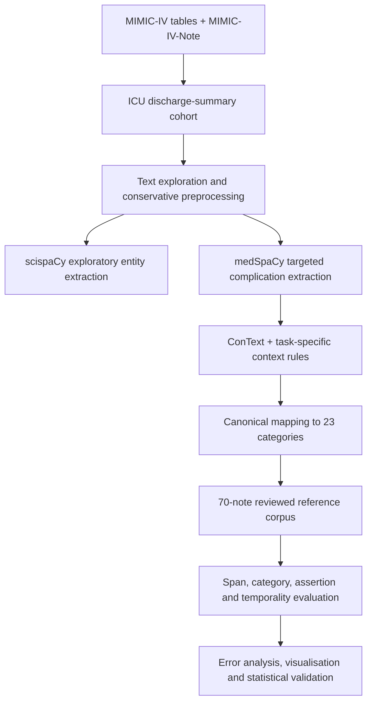
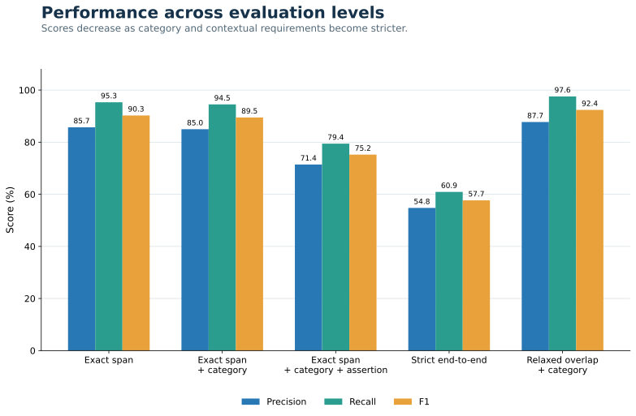
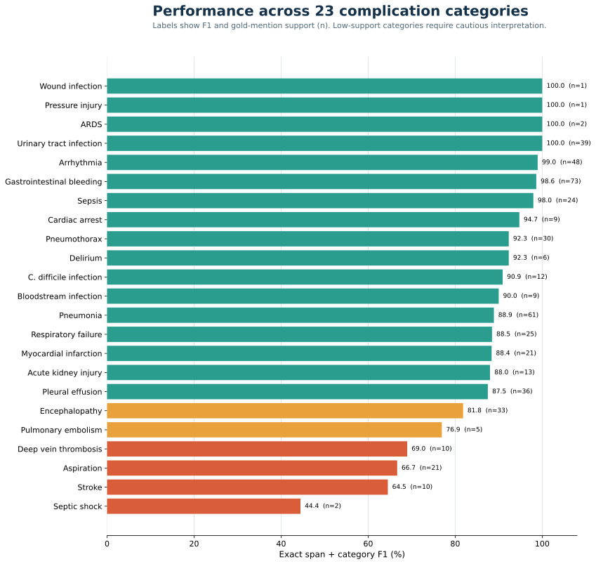
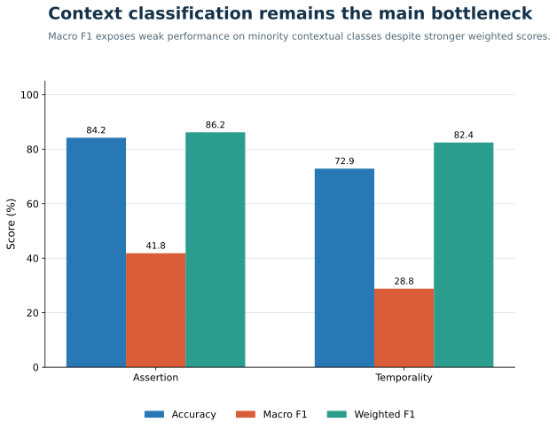

# Clinical Complication Detection from MIMIC-IV Discharge Summaries

<p align="center">
  <strong>A reproducible clinical NLP pipeline for extracting, contextualising and evaluating complication mentions in ICU discharge summaries</strong>
</p>

<p align="center">
  
  
  
  
  
</p>

**Author:** Anthony Amit Biswas  
**Domain:** Clinical NLP · Electronic health records · Information extraction · Explainable rule-based NLP

---

## Why this repository exists

Important clinical events are often recorded in free-text discharge summaries rather than clean structured fields. This project investigates whether a transparent clinical NLP pipeline can identify complication mentions, map them to a fixed clinical taxonomy, and determine whether each mention is affirmed, negated, uncertain, historical or temporally current.

Because MIMIC-IV-Note is credentialed, this repository cannot publish the source notes, patient identifiers, text-bearing annotation workbooks or restricted derivatives. Instead, the repository documents the complete analytical design through:

- ten sequential, sanitised notebooks;
- the extraction rules and complication taxonomy;
- cohort and annotation methodology;
- complete aggregate evaluation tables;
- privacy-safe visualisations;
- error analysis and interpretation;
- reproducibility and data-access instructions.

The project is exploratory research software. It is **not a clinically validated or deployable decision-support system**.

## At a glance

| Component | Value |
| --- | ---: |
| ICU discharge summaries in the full cohort | 65,323 |
| Complication categories | 23 |
| Reviewed evaluation summaries | 70 |
| Randomly sampled summaries | 50 |
| Category-enriched summaries | 20 |
| Reference complication mentions | 491 |
| Notes containing reference mentions | 60 |
| Canonical system predictions | 546 |
| Notes containing predictions | 63 |
| Exact-span matches | 468 |
| Exact-span F1 | 0.9026 |
| Exact-span + category F1 | 0.8949 |
| Relaxed-overlap + category F1 | 0.9238 |
| Strict end-to-end F1 | 0.5767 |

## Research objectives

1. Construct a valid ICU discharge-summary cohort from MIMIC-IV and MIMIC-IV-Note.
2. Characterise the structure and quality of the clinical free text.
3. Preprocess the text conservatively without removing medically meaningful context.
4. Explore broad biomedical mentions using scispaCy.
5. Build a targeted medSpaCy pipeline for 23 complication categories.
6. Assign assertion and temporality attributes using ConText and task-specific rules.
7. Construct a reviewed reference corpus and evaluate span, category and context performance separately.
8. Identify failure modes through quantitative and qualitative error analysis.
9. Produce publication-quality figures, statistical validation and a reproducible public code package.

## End-to-end workflow



### Pipeline design

| Stage | Implementation | Purpose |
| --- | --- | --- |
| Cohort construction | pandas joins and validation | Connect ICU stays, admissions, patients and discharge summaries. |
| Text exploration | section and length analysis | Understand note structure before modelling. |
| Preprocessing | conservative regex cleaning | Remove formatting noise and de-identification placeholders while preserving clinical content. |
| Exploratory NLP | scispaCy `en_core_sci_sm` | Measure broad biomedical mention behaviour across the cohort. |
| Target extraction | medSpaCy `TargetMatcher` | Detect predefined complication terms and variants. |
| Context detection | medSpaCy `ConText` plus explicit rules | Classify negation, uncertainty, historical and hypothetical contexts. |
| Canonicalisation | deterministic terminology mapping | Map variants and abbreviations to 23 complication categories. |
| Annotation | 50 random + 20 category-enriched notes | Create a reviewed evaluation set with coverage of common and rare categories. |
| Evaluation | exact and relaxed one-to-one matching | Separate boundary, category and contextual performance. |
| Validation | integrity checks and statistical analysis | Verify offsets, matching, manifests and frozen outputs. |

## Clinical complication taxonomy

The final targeted system maps lexical variants to these canonical categories:

| | | |
| --- | --- | --- |
| Acute kidney injury | ARDS | Arrhythmia |
| Aspiration | Bloodstream infection | Cardiac arrest |
| *C. difficile* infection | Deep vein thrombosis | Delirium |
| Encephalopathy | Gastrointestinal bleeding | Myocardial infarction |
| Pleural effusion | Pneumonia | Pneumothorax |
| Pressure injury | Pulmonary embolism | Respiratory failure |
| Sepsis | Septic shock | Stroke |
| Urinary tract infection | Wound infection | |

The taxonomy is deliberately bounded. The system does not attempt unrestricted diagnosis extraction or infer complications that are not explicitly supported by the note text.

## Extraction strategy

### Why scispaCy and medSpaCy were both used

- **scispaCy** provided broad biomedical entity extraction for exploratory analysis. It helped characterise the volume and diversity of biomedical mentions but was not used as the final complication classifier.
- **medSpaCy** supported transparent, task-specific extraction through lexical target rules and ConText attributes. This was selected for the final system because every detection rule and contextual decision could be inspected.

### Efficiency and robustness

The full cohort was processed in resumable shards rather than held entirely in memory. The pipeline includes:

- candidate-segment prefiltering;
- safe section-aware text segmentation;
- neighbouring-context preservation;
- fixed-size shard processing;
- resumable execution after runtime interruption;
- per-shard manifests and validation;
- streaming aggregation of mention statistics.

The medSpaCy stage processed all 65,323 summaries across 262 production shards and produced 379,142 mention-level records before evaluation filtering and canonical comparison.

## Reference corpus

The evaluation sample combined:

- **50 randomly selected summaries** to represent general cohort performance;
- **20 category-enriched summaries** to improve coverage of less frequent complication types;
- **one summary per patient** to reduce patient-level dependence;
- a five-note pilot followed by review of the complete 70-note set;
- candidate review plus full-text review to identify missed mentions.

The final reference table contained **491 positive complication mentions**. The reference construction was candidate-assisted, so the results should be interpreted as an internal evaluation rather than fully independent external validation.

## How evaluation was defined

The evaluation becomes progressively stricter:

1. **Exact span:** predicted and reference character boundaries must match.
2. **Exact span + category:** boundaries and canonical complication category must match.
3. **Exact span + category + assertion:** the assertion label must also match.
4. **Strict end-to-end:** span, category, assertion and temporality must all match.
5. **Relaxed overlap + category:** one-to-one overlapping spans with the correct category are accepted to measure boundary sensitivity.

For every level:

```text
Precision = TP / (TP + FP)
Recall    = TP / (TP + FN)
F1        = 2 × Precision × Recall / (Precision + Recall)
```

## Complete overall results

| Evaluation level | TP | FP | FN | Precision | Recall | F1 |
| --- | ---: | ---: | ---: | ---: | ---: | ---: |
| Exact span | 468 | 78 | 23 | 0.8571 | 0.9532 | 0.9026 |
| Exact span + category | 464 | 82 | 27 | 0.8498 | 0.9450 | 0.8949 |
| Exact span + category + assertion | 390 | 156 | 101 | 0.7143 | 0.7943 | 0.7522 |
| Exact span + category + assertion + temporality | 299 | 247 | 192 | 0.5476 | 0.6090 | 0.5767 |
| Relaxed overlap span | 479 | 67 | 12 | 0.8773 | 0.9756 | 0.9238 |
| Relaxed overlap + category | 479 | 67 | 12 | 0.8773 | 0.9756 | 0.9238 |



### Interpretation

- Exact-span detection achieved high recall (0.9532), showing that most reference mentions were retrieved.
- Adding the complication category caused only a small F1 reduction, indicating that canonical mapping was strong when spans matched.
- Relaxed matching improved F1 from 0.8949 to 0.9238, showing that a portion of the remaining errors came from boundary disagreement rather than the wrong clinical category.
- Strict end-to-end F1 fell to 0.5767 because assertion and temporality had to be correct in addition to the span and category.

## Category classification

On the 468 exact-span matches:

| Metric | Value |
| --- | ---: |
| Category accuracy | 0.9915 |
| Category macro F1 | 0.9937 |
| Gold-supported categories | 23 |
| Macro per-category precision | 0.8257 |
| Macro per-category recall | 0.9539 |
| Macro per-category F1 | 0.8697 |

### Full per-category results

These values require an exact span and correct complication category. Support is the number of reference mentions.

| Category | Support | Predictions | TP | FP | FN | Precision | Recall | F1 |
| --- | ---: | ---: | ---: | ---: | ---: | ---: | ---: | ---: |
| Gastrointestinal bleeding | 73 | 73 | 72 | 1 | 1 | 0.9863 | 0.9863 | 0.9863 |
| Pneumonia | 61 | 65 | 56 | 9 | 5 | 0.8615 | 0.9180 | 0.8889 |
| Arrhythmia | 48 | 47 | 47 | 0 | 1 | 1.0000 | 0.9792 | 0.9895 |
| Urinary tract infection | 39 | 39 | 39 | 0 | 0 | 1.0000 | 1.0000 | 1.0000 |
| Pleural effusion | 36 | 44 | 35 | 9 | 1 | 0.7955 | 0.9722 | 0.8750 |
| Encephalopathy | 33 | 33 | 27 | 6 | 6 | 0.8182 | 0.8182 | 0.8182 |
| Pneumothorax | 30 | 35 | 30 | 5 | 0 | 0.8571 | 1.0000 | 0.9231 |
| Respiratory failure | 25 | 27 | 23 | 4 | 2 | 0.8519 | 0.9200 | 0.8846 |
| Sepsis | 24 | 25 | 24 | 1 | 0 | 0.9600 | 1.0000 | 0.9796 |
| Aspiration | 21 | 27 | 16 | 11 | 5 | 0.5926 | 0.7619 | 0.6667 |
| Myocardial infarction | 21 | 22 | 19 | 3 | 2 | 0.8636 | 0.9048 | 0.8837 |
| Acute kidney injury | 13 | 12 | 11 | 1 | 2 | 0.9167 | 0.8462 | 0.8800 |
| *C. difficile* infection | 12 | 10 | 10 | 0 | 2 | 1.0000 | 0.8333 | 0.9091 |
| Deep vein thrombosis | 10 | 19 | 10 | 9 | 0 | 0.5263 | 1.0000 | 0.6897 |
| Stroke | 10 | 21 | 10 | 11 | 0 | 0.4762 | 1.0000 | 0.6452 |
| Bloodstream infection | 9 | 11 | 9 | 2 | 0 | 0.8182 | 1.0000 | 0.9000 |
| Cardiac arrest | 9 | 10 | 9 | 1 | 0 | 0.9000 | 1.0000 | 0.9474 |
| Delirium | 6 | 7 | 6 | 1 | 0 | 0.8571 | 1.0000 | 0.9231 |
| Pulmonary embolism | 5 | 8 | 5 | 3 | 0 | 0.6250 | 1.0000 | 0.7692 |
| ARDS | 2 | 2 | 2 | 0 | 0 | 1.0000 | 1.0000 | 1.0000 |
| Septic shock | 2 | 7 | 2 | 5 | 0 | 0.2857 | 1.0000 | 0.4444 |
| Pressure injury | 1 | 1 | 1 | 0 | 0 | 1.0000 | 1.0000 | 1.0000 |
| Wound infection | 1 | 1 | 1 | 0 | 0 | 1.0000 | 1.0000 | 1.0000 |



Perfect scores for categories with one or two examples are not evidence of generalisable performance. The support labels in the figure make this uncertainty explicit.

## Assertion and temporality

Context labels were evaluated on 468 exact-span matches.

| Attribute | Evaluated mentions | Correct | Accuracy | Macro precision | Macro recall | Macro F1 | Weighted F1 |
| --- | ---: | ---: | ---: | ---: | ---: | ---: | ---: |
| Assertion | 468 | 394 | 0.8419 | 0.4458 | 0.4596 | 0.4182 | 0.8617 |
| Temporality | 468 | 341 | 0.7286 | 0.3124 | 0.2739 | 0.2879 | 0.8244 |



The large gap between weighted and macro F1 reflects class imbalance. Common labels performed much better than rare contextual classes.

### Assertion results

| Label | Precision | Recall | F1 | Support |
| --- | ---: | ---: | ---: | ---: |
| Affirmed | 0.8980 | 0.9086 | 0.9032 | 339 |
| Negated | 0.9242 | 0.6630 | 0.7722 | 92 |
| Uncertain | 0.8000 | 0.6857 | 0.7385 | 35 |
| Historical | 0.0526 | 0.5000 | 0.0952 | 2 |

### Temporality results

| Label | Precision | Recall | F1 | Support |
| --- | ---: | ---: | ---: | ---: |
| Current | 0.9767 | 0.7428 | 0.8438 | 451 |
| Historical | 0.2727 | 0.3529 | 0.3077 | 17 |

## Main findings

1. **Mention detection was strong.** Exact-span F1 reached 0.9026 and relaxed-overlap F1 reached 0.9238.
2. **Canonical category mapping was reliable for matched spans.** Category accuracy was 0.9915 on exact-span matches.
3. **Boundary errors were present but not dominant.** Relaxed matching recovered 11 additional true positives.
4. **Context classification was the principal bottleneck.** Rare assertion and temporality classes substantially reduced macro F1 and strict end-to-end performance.
5. **Performance varied by complication.** Septic shock, stroke, aspiration and deep vein thrombosis produced more false positives relative to their support.
6. **Small category supports require restraint.** Several apparently perfect category scores were based on only one or two reference mentions.

## Notebook-by-notebook guide

| Notebook | What it does | Main outputs |
| --- | --- | --- |
| [01 — Explore MIMIC notes](notebooks/01_explore_mimic_notes.ipynb) | Loads and validates MIMIC-IV tables, links ICU stays to discharge summaries and creates the NLP cohort. | Cohort tables, join validation and descriptive summaries. |
| [02 — Understand clinical text](notebooks/02_understanding_clinical_text.ipynb) | Examines note structure, section headings, text length and recurring clinical terminology. | Section-frequency and text-quality summaries. |
| [03 — Preprocess clinical text](notebooks/03_clinical_text_preprocessing.ipynb) | Removes de-identification placeholders and formatting noise conservatively. | Validated cleaned-text cohort. |
| [04 — scispaCy extraction](notebooks/04_scispacy_clinical_entity_extraction.ipynb) | Benchmarks and runs broad biomedical entity extraction in resumable shards. | Mention shards, manifests and frequency summaries. |
| [05 — medSpaCy extraction](notebooks/05_medspacy_complication_extraction.ipynb) | Defines the taxonomy, lexical rules, segmentation, contextual processing and final targeted extraction. | Canonical mention, context, prevalence and QA outputs. |
| [06 — Reference annotation](notebooks/06_gold_standard_annotation.ipynb) | Builds the 70-note sample and validates the reviewed annotation workflow. | Frozen sample manifest and reference annotations. |
| [07 — System evaluation](notebooks/07_system_evaluation.ipynb) | Validates offsets and performs exact, relaxed, category and contextual evaluation. | Metric tables, matched pairs, FP/FN tables and final evaluation report. |
| [08 — Error analysis](notebooks/08_error_analysis_and_interpretation.ipynb) | Profiles boundary, category, assertion and temporality errors without changing frozen predictions. | Error taxonomy, diagnostic tables and interpretations. |
| [09 — Visualisation](notebooks/09_publication_quality_visualisations.ipynb) | Produces consistent figures and summary assets from validated outputs. | Publication-ready PNG, PDF and SVG figures. |
| [10 — Reproducibility and statistics](notebooks/10_reproducibility_and_statistical_validation.ipynb) | Generates confidence intervals, statistical tests, manifests, checksums and documentation. | Reproducibility reports and statistical-validation tables. |

## Repository structure

```text
clinical-complication-detection-mimiciv/
├── README.md
├── DATA_ACCESS.md
├── CITATION.cff
├── LICENSE
├── requirements.txt
├── assets/
│   ├── evaluation_performance.svg
│   ├── category_performance.svg
│   └── context_performance.svg
└── notebooks/
    ├── 01_explore_mimic_notes.ipynb
    ├── 02_understanding_clinical_text.ipynb
    ├── 03_clinical_text_preprocessing.ipynb
    ├── 04_scispacy_clinical_entity_extraction.ipynb
    ├── 05_medspacy_complication_extraction.ipynb
    ├── 06_gold_standard_annotation.ipynb
    ├── 07_system_evaluation.ipynb
    ├── 08_error_analysis_and_interpretation.ipynb
    ├── 09_publication_quality_visualisations.ipynb
    └── 10_reproducibility_and_statistical_validation.ipynb
```

## Running the project

### 1. Obtain authorised data access

Request access to [MIMIC-IV](https://physionet.org/content/mimiciv/) and MIMIC-IV-Note through PhysioNet. Complete the required credentialing and comply with the applicable data-use agreement.

### 2. Clone and create an environment

```bash
git clone https://github.com/Anthonyamit5787/clinical-complication-detection-mimiciv.git
cd clinical-complication-detection-mimiciv
python -m venv .venv
source .venv/bin/activate
pip install -r requirements.txt
```

On Windows PowerShell, activate with:

```powershell
.venv\Scripts\Activate.ps1
```

### 3. Configure local paths

Place authorised source files in a local directory excluded by `.gitignore`, or update the configurable project-root cells in the notebooks. Do not commit source notes or text-bearing derivatives.

### 4. Run sequentially

Execute Notebooks 01–10 in order. Later notebooks intentionally validate and consume frozen outputs from earlier stages. Notebooks 04 and 05 retain their tested, notebook-specific NLP installation cells because scispaCy and medSpaCy were run with different validated spaCy configurations.

## Data governance and privacy

The repository intentionally excludes:

- MIMIC-IV and MIMIC-IV-Note source files;
- raw or preprocessed discharge-summary text;
- patient, admission and note identifiers;
- annotation workbooks containing clinical text;
- mention-level exports that reproduce source passages;
- model outputs containing restricted snippets;
- notebook execution outputs that displayed source notes.

The public notebooks contain code and technical explanation only. See [DATA_ACCESS.md](DATA_ACCESS.md) for the complete repository boundary.

## Reproducibility safeguards

- fixed random seeds for sampling;
- one-to-one exact and relaxed matching;
- unique prediction and annotation identifiers;
- offset and source-text validation;
- resumable shard processing;
- frozen upstream outputs for later analyses;
- per-stage validation reports;
- project manifests and SHA256 checksums;
- note-level bootstrap design for uncertainty estimation;
- McNemar testing only when valid paired outcomes can be constructed.

## Limitations

- The evaluation corpus contains only 70 summaries and some categories have very low support.
- The category-enriched portion improves coverage but does not represent natural prevalence.
- Reference construction was candidate-assisted and was not independently double-annotated.
- Inter-annotator agreement was not available.
- The terminology and rules were developed for this dataset and require external validation.
- Rule-based context handling struggled with rare historical and temporality classes.
- Results from MIMIC-IV ICU summaries may not transfer directly to other hospitals, note types or specialties.
- No prospective clinical evaluation was performed.

## Future work

- independent dual annotation and adjudication;
- inter-annotator agreement measurement;
- external validation on another clinical-note corpus;
- improved section-aware assertion and temporality rules;
- transformer-based or hybrid rule/neural comparison;
- confidence calibration and uncertainty analysis;
- larger evaluation samples for low-support categories;
- prospective clinical review before any operational consideration.

## Technology stack

- Python, pandas and NumPy
- spaCy, scispaCy and `en_core_sci_sm`
- medSpaCy `TargetMatcher` and `ConText`
- scikit-learn and SciPy
- Matplotlib and Seaborn
- openpyxl
- Jupyter/Google Colab

## Citation

Citation metadata is provided in [CITATION.cff](CITATION.cff). GitHub can generate a formatted citation from the repository’s **Cite this repository** control.

## Licence

Repository code is released under the [MIT License](LICENSE). MIMIC-IV data remains subject to PhysioNet’s terms and is not covered by this licence.

---

If this project is useful, consider starring the repository or opening an issue with constructive feedback.
